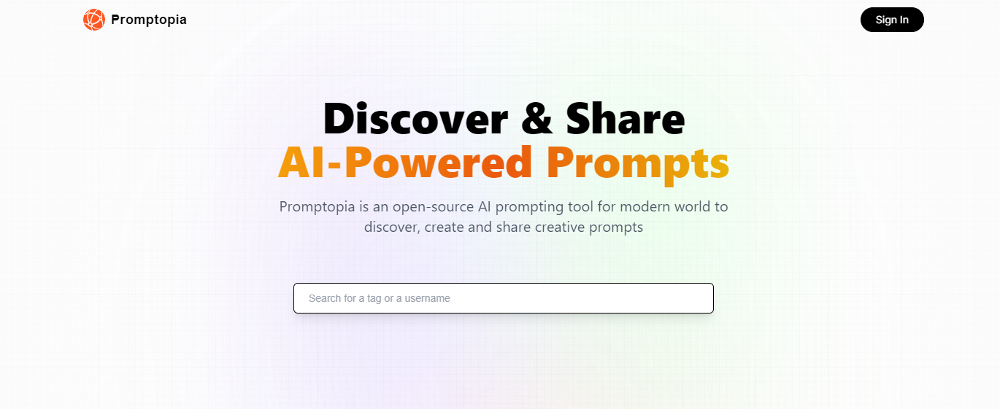

# Promptopia: Message Platform for AI Chat

Welcome to **Promptopia**, a web application built with Next.js that allows users to create and share messages, which can then be used as prompts for an artificial intelligence (AI) chat. This platform facilitates collaboration and idea exchange, providing users with an effective tool for interacting with AI models.



## Features

- **Message Creation**: Users can compose messages and save them on the platform.
- **Message Sharing**: Created messages can be shared with other users to facilitate collaboration and idea exchange.
- **AI Chat Integration**: Shared messages can be used as prompts for interactions with AI-based chatbots.
- **Authentication and Authorization**: Utilizes `next/auth` for managing user registration, login, and permissions securely.
- **Internal APIs**: Implements custom APIs within the project to handle operations related to messages and users.

## Technologies Used

- **Next.js**: React framework that enhances performance and user experience with features like server-side rendering and static site generation.
- **next/auth**: Solution for user authentication and authorization in Next.js applications.
- **API Routes**: Internal APIs to manage backend operations directly within the Next.js project.
- **Database**: Use [name of the database system] for storing messages and user data. (Adjust this based on your implementation.)

## Installation

To install and run **Promptopia** locally, follow these steps:

1. Clone the repository:
```bash
  git clone https://github.com/Aranguez/promptopia.git
```

2. Navigate to the project directory:
```bash
  cd promptopia
```

3. Install the dependencies:
```bash
  npm install
```

4. Configure the environment variables by following the instructions in the .env.example file. Create a .env file in the root of the project with the necessary configurations.

5. Start the development server:
```bash
  npm run dev
```